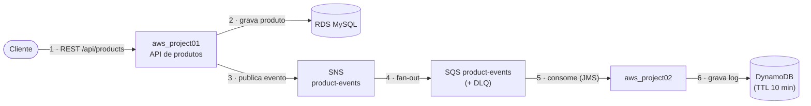
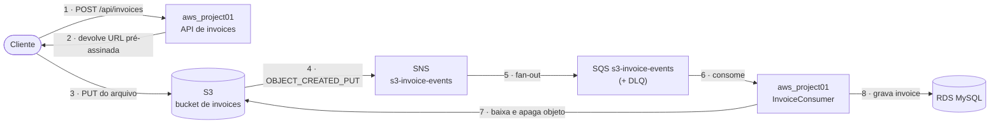

# aws-ecs-fargate-java

Projeto de estudo que implementa uma pequena plataforma orientada a eventos na AWS, com aplicações Java (Spring Boot) executadas em **ECS Fargate** e toda a infraestrutura provisionada via **AWS CDK**. O objetivo é praticar, de ponta a ponta, o ciclo de **desenvolver → conteinerizar → provisionar → operar** serviços na nuvem.

## O que o projeto faz

São dois microsserviços que se comunicam de forma **assíncrona** por mensageria, cobrindo dois domínios:

1. **Produtos** — `aws_project01` expõe uma API REST de CRUD de produtos. Cada alteração (criar/atualizar/excluir) publica um evento no SNS. `aws_project02` consome esses eventos de uma fila SQS e registra um histórico no DynamoDB.
2. **Notas fiscais (invoices)** — `aws_project01` também recebe o upload de notas fiscais via **URL pré-assinada do S3**. Quando o arquivo chega ao bucket, o S3 dispara uma notificação que, passando por SNS e SQS, é processada de forma assíncrona pelo próprio serviço, que persiste a nota no banco relacional.

A ideia central que o projeto exercita é o padrão **event-driven com fan-out** (SNS → SQS), desacoplando quem produz o evento de quem o processa, com fila de retentativa (DLQ) para mensagens com falha.

## Arquitetura

O sistema tem **dois fluxos independentes**, cada um descrito abaixo com seu próprio diagrama. Em ambos, o número em cada seta indica a ordem dos passos.

### Fluxo de produtos (assíncrono entre dois serviços)



1. O cliente chama a API REST de `aws_project01` (`/api/products`).
2. A cada create/update/delete, o serviço persiste no banco e publica um `ProductEvent` no tópico SNS `product-events`.
3. O tópico faz **fan-out** para a fila SQS `product-events` (com dead-letter queue após 3 tentativas).
4. `aws_project02` escuta a fila via **JMS listener**, desempacota o envelope SNS e grava um `ProductEventLog` no **DynamoDB** (chave composta `pk`/`sk`, com TTL de 10 minutos). O serviço também expõe endpoints de consulta desse histórico.

### Fluxo de notas fiscais (upload via S3 + processamento assíncrono)



1. O cliente pede uma **URL pré-assinada** em `POST /api/invoices`; o serviço devolve uma URL temporária de `PUT` para o bucket S3.
2. O cliente faz o upload do arquivo JSON da nota diretamente para o S3 usando essa URL (sem passar o payload pela aplicação).
3. Ao criar o objeto, o S3 emite uma notificação `OBJECT_CREATED_PUT` para o tópico SNS `s3-invoice-events`, que entrega na fila SQS correspondente (com DLQ).
4. O `InvoiceConsumer` (no próprio `aws_project01`) consome a fila, baixa o objeto do S3, persiste a `Invoice` no **RDS** e apaga o arquivo do bucket. Notificações sem registros (ex.: `s3:TestEvent`) são ignoradas.

> Por que URL pré-assinada? Assim o arquivo vai direto do cliente para o S3, sem ocupar a aplicação com o tráfego do upload — e o processamento acontece de forma assíncrona, acionado pelo evento do próprio S3.

## Estrutura do projeto

```
aws_project01/   # Spring Boot (Gradle) — CRUD de produtos + API de invoices
                 #   publica eventos no SNS e consome a fila de invoices (S3→SNS→SQS)
aws_project02/   # Spring Boot (Gradle) — consome eventos de produto da SQS (JMS) e
                 #   grava o histórico no DynamoDB; expõe consultas do log
aws_cdk/         # Infraestrutura como código em AWS CDK (Maven) — provisiona tudo acima
```

Cada subprojeto tem seu próprio README/instruções de build. Detalhes de comandos (build, Docker, deploy e o fluxo de versionamento das imagens) estão documentados em `CLAUDE.md`.

## Tecnologias praticadas

- **Java 17** + **Spring Boot 3.2** (REST, Data JPA, JMS) — aplicações e CDK
- **Gradle** (apps) e **Maven** (CDK) para build
- **Docker** + **Docker Hub** — imagens `linux/amd64` publicadas no registry
- **AWS CDK (Java)** — infraestrutura como código
- **ECS Fargate** + **ALB** — execução dos containers e exposição pública (porta 8080)
- **VPC** — rede com subnets isoladas para o banco
- **RDS (MySQL 8.0)** — persistência de produtos e notas fiscais
- **SNS + SQS (com DLQ)** — mensageria com padrão fan-out e retentativa
- **S3** — armazenamento dos arquivos de nota fiscal, com notificação por evento
- **DynamoDB** — histórico de eventos de produto (com TTL)
- **CloudWatch** — logs dos containers

## Notas de custo (RDS)

> **MySQL 8.0 em vez de 5.7 (divergência do curso):** o curso orienta a usar o **MySQL 5.7**, porém essa versão já saiu do suporte padrão da AWS e a RDS **cobra automaticamente o Extended Support por vCPU-hora**. Em testes de estudo isso foi de longe o maior custo da stack (~$0.10/vCPU-hora). Por isso a `RdsStack` usa **`MysqlEngineVersion.VER_8_0`**, que continua em suporte padrão e elimina essa cobrança. A aplicação Spring/JPA funciona igual no 8.0.

Outros ajustes de custo aplicados na `RdsStack` para ambiente de estudo:
- **Graviton (`db.t4g.micro`)** em vez de `db.t3.micro` — mesma performance, mais barato.
- **Storage `gp2` com 10 GB** — o `gp3` no MySQL exige mínimo de 20 GB, o que dobraria o storage sem ganho real nesse tamanho.
- **Sem backups automáticos** (`backupRetention` 0, `deleteAutomatedBackups`) — não há snapshots cobrados.
- **`removalPolicy DESTROY` + `deletionProtection false`** — permite `cdk destroy` limpo ao encerrar o estudo.

💡 Para estudo, o maior economizador é **`cdk destroy --all` ao terminar o dia**: RDS, Fargate e ALB cobram por hora ligados, não por uso.
